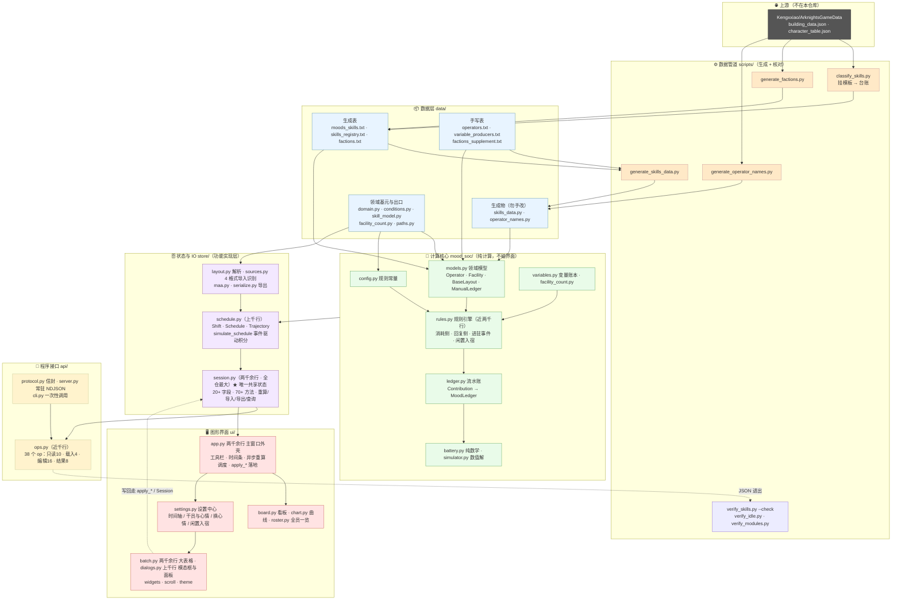
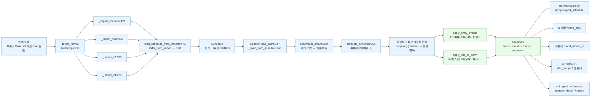
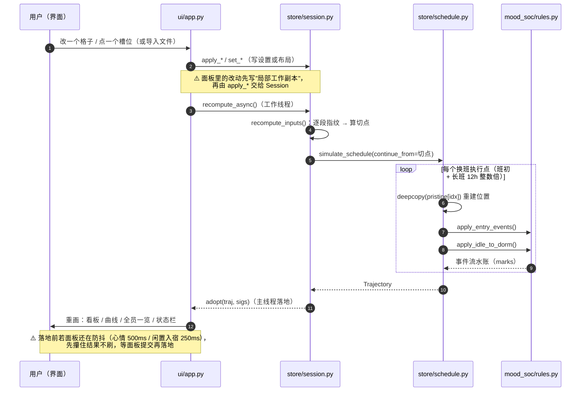
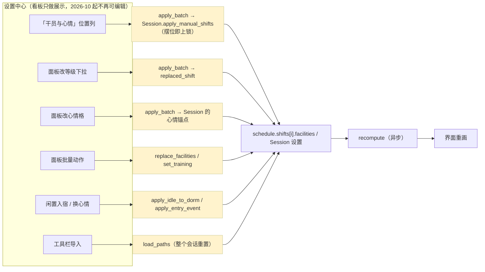

# 14-架构总览（现状测绘 + 病灶清单）

> **这份文件是"体检报告"，不是"设计规范"** —— 设计意图与公共 API 看 `01-架构.md`，
> 解释性口径与踩过的坑看 `04-特殊机制.md`，为什么长成这样看 `07-设计史.md`。
>
> **它怎么来的**：2026-10 做"把配置拆成六个模块"这件事之前，先把**整个项目**重新测绘一遍
> （四条线 + 横切关注点），避免"只重排表现层、把底层的老问题原样留着"。
> 每条结论都带 `file:line`，可以直接跳过去核。**只读调查产出，没有改任何代码。**
>
> **怎么用它**：先读 §1（一页地图）→ §7（病灶清单，逐条裁决）→ 再回 §2~§6 看某一处的细节。
>
> ⚠️ **行数口径**：全部是 `wc -l`（＝ `read` 工具的 total，含空行）。
> **别用 PowerShell 的 `Measure-Object -Line`**，它漏空行、会小几十个百分点。

---

> **目录**：§1 一页地图（1.1~1.4）· §2 线①数据管道 · §3 线②状态与 IO · §4 线③图形界面 ·
> §5 线④对外面 · §6 横切关注点（6.1~6.4）· §7 病灶清单（7.1~7.13）· §8 旧六模块草案 ·
> §9 模块划分（9.1~9.5）· §10 状态归属 · §11 接口落点 · §12 判据 · §13 实施三步 · §14 与旧方案差别

## 1. 一页地图

### 1.1 规模（**只给有界说法**，`py` 行数含空行）

| 层 | 文件数 | 规模（有界说法） | 最大文件 |
|---|---|---|---|
| `data/` | 8 py + 6 txt | **最大的一层**（近 1 万行，仅 py） | `skills_data.py` 七千余行（生成物，勿手改） / `operator_names.py` 上百行 |
| `ui/` | 13 | **七千余行** | `app.py` 两千余行 / `batch.py` 两千余行 |
| `tests/` | 18 | **上万行** | `test_ui_app_smoke.py` 近两千行 |
| `store/` | 7 | **五千余行** | `session.py` **两千余行（全仓最大）** / `schedule.py` 上千行 |
| `scripts/` | 9 | **五千余行** | `verify_skills.py` / `verify_idle.py` 各上千行 |
| `mood_soc/` | 16 | **四千余行** | `rules.py` 近两千行 / `models.py` 上千行 |
| `api/` | 5 | **上千行** | `ops.py` 近千行 |
| 根 | 1 | **上百行** | — |
| **合计** | **77** | **四万余行** | — |

（`tests/` 与 `scenarios/` 整目录不入库：`.gitignore:29-30`。）

> ⚠️ **本表只给有界 / 定性说法** —— **绝对行数的唯一快照在
> `16-现状与校准记录.md` §1.1**（那里带实测时刻与口径说明），要数字去那里引，别在这里另抄一份。
> 本表是在 **2026-10 本轮（锁定入宿 / 导入原样 / 换心情放宽）之后**把绝对行数换成有界说法的；
> 相对信息保留且不会漂：**`data/` 最重、`store/session.py` 是全仓最大的单文件**。
> ⚠️ 上一轮那些字面值（`session.py` 1732 → 今天两千余行、`store/` 4531 → 五千余行、
> `ui/` 7312 → 七千余行）**每一批改动都会漂** —— 这正是本表改成有界说法的原因。

### 1.2 分层与依赖方向

```
                    ┌─────────────┐   ┌─────────────┐
                    │   ui/  (视图) │   │  api/ (JSON) │      ← 两个入口，互不 import
                    └──────┬──────┘   └──────┬──────┘
                           └────────┬────────┘
                                    ▼
                          ┌───────────────────┐
                          │ store/ 状态与 IO   │  Session / Schedule / Trajectory / 4 种导入 / 序列化
                          └─────────┬─────────┘
                                    ▼
                          ┌───────────────────┐
                          │ mood_soc/ 纯计算   │  rules / ledger / variables / models / config
                          └─────────┬─────────┘
                                    ▼
                          ┌───────────────────┐
                          │ data/ 数据与基元   │  表(txt/py) + domain + conditions + paths
                          └───────────────────┘
```

**静态约束**（`tests/test_layers.py` 扫源码盯着）：`ui`/`api` 不许互 import（`:70-72`）、
`ui/` 只许 import `store`/`mood_soc`/`data`（`:91-100`）、`ui/` 不许手拼 `resources/`（`:138-150`）。

**运行期有一条回头路**（病灶 §7.9）：`mood_soc/scenario.py:23` 是 `mood_soc/` 里**唯一**向上
import 的模块（`from store.layout import *`），而 `mood_soc/rules.py:1139` 在函数体内
`from .scenario import build_operator` —— 于是**引擎在跑的时候依赖解析层**。

### 1.3 两个入口各自怎么走

```
导入文件 ──► store/sources.py: detect_format(256) 识别 4 种格式
              └─► _import_scenario(421) / _import_maa(496) / _import_v3(630) / _import_v4(729)
                    └─► load_schedule_from_imports(473) → shifts_from_import(138) → Schedule(247)
                          └─► Session.load_paths(147) / load_data(161) → _sync_from_schedule(240) → recompute(419)

一次重算 ──► Session.recompute(419) → recompute_inputs(355)      ← 增量切点在这里算
              └─► simulate_schedule(968)                          ← 事件驱动精确积分
                    └─► 段循环：每个换班执行点 deepcopy(pristine[idx])(1188)
                          ├─ apply_entry_events(rules 765)         ← 进驻事件（换心情/位置）
                          └─ apply_idle_to_dorm(rules 1100)        ← 闲置入宿（填空床/换人）
                    └─► Trajectory(542) → ui/app.py 看板 + 曲线 + 对点查询 / api layout_at、moods
```

### 1.4 三个核心数据结构

| 结构 | 位置 | 一句话 |
|---|---|---|
| `Session` | `store/session.py:91` | **唯一共享状态载体**：20+ 字段 / 70+ 方法 / 两千余行（实测值见 `16-现状与校准记录.md` §1.1），`ui` 与 `api` 都拿它当数据源 |
| `Schedule` / `Shift` | `store/schedule.py:248` / `:89` | 排班＝若干班次；每班 `facilities: List[dict]` 是**布局的本体**；编辑一律**换新对象** |
| `Trajectory` | `store/schedule.py:542` | 算好的整周期轨迹：`times` + 每人心情序列 + `marks` + 逐段布局副本 + 闲置入宿的逐位宿舍态/说明 |

---

## 2. 线①：数据管道（上游 → `data/` → `mood_soc`）

### 2.1 `data/` 的六张表与两张生成物

| 文件 | 行 | 谁写它 | 性质 |
|---|---|---|---|
| `moods_skills.txt` | 251 | `scripts/classify_skills.py:297` | 生成物（clause 级技能库，12 列含 `template_id/params`） |
| `skills_registry.txt` | 756 | `scripts/classify_skills.py:441` | 生成物（上游 755 条 buff 台账） |
| `factions.txt` | 232 | `scripts/generate_factions.py:124` | 生成物 |
| **`operators.txt`** | **近千** | **没有人写它** | **人工维护**（只被 `generate_skills_data.py:250/493/725` 读） |
| `factions_supplement.txt` | 39 | 手写（`:3` 标注） | 上游不给名单的补充 |
| `variable_producers.txt` | 35 | 手写 | 变量产出者表 |
| `skills_data.py` | 7631 | `scripts/generate_skills_data.py:795` | **生成物，勿手改**（8 张表：`SKILLS`/`DEFAULT_OPERATORS`/…） |
| `operator_names.py` | 上百 | `scripts/generate_operator_names.py:161` | **生成物，勿手改**（别名表） |

**数据管道**（改数据必须按序重跑，`AGENTS.md:414-417`）：
`classify_skills.py --agd <上游>` → `generate_skills_data.py` → `classify_skills.py --check`；
两条支线：`generate_factions.py`（改阵营）、`generate_operator_names.py`（改别名）。

### 2.2 `mood_soc/` 的十六个模块

| 模块 | 行 | 职责 |
|---|---|---|
| `rules.py` | **近两千** | 规则引擎：消耗/回复两侧 + 进驻事件 + 闲置入宿 + 解析解入口（§4.1 有分段表） |
| `models.py` | 上千 | 领域模型 + **占位/台账原语**（`ManualLedger`、`set_seat`、`facility_occupancy`） |
| `skill_templates.py` | 336 | 六轴枚举 + 模板字典 `M_/X_TEMPLATES` |
| `ledger.py` | 319 | 流水账：`Contribution` → `MoodLedger.total()`（**唯一计算路径**） |
| `variables.py` | 259 | 26 种变量 + `basis_count`（9 种计数基准） |
| `config.py` | 251 | 规则常量与公式（基础消耗表、中枢减免、宿舍回复、`use_project_decimal_context`） |
| `__init__.py` | 101 | 门面（re-export；`build_base_layout` 用 PEP 562 惰性转发 `store.layout`） |
| `battery.py` | 99 | 纯数学（`to_decimal` / `clamp` / `ampere_hour_integration`） |
| `skills.py` | 93 | 兼容门面（re-export `data.skills_data`） |
| `facility_count.py` | 92 | 「仅影响设施数量」两条技能（森蚺 +2 / 晨曦 +1） |
| `simulator.py` | 60 | 数值解（每步重算速率的 `--trace` 路径） |
| `report.py` | 46 | 文本渲染 |
| **`scenario.py`** | **23** | **转发壳，向上 import `store.layout`（唯一一处）** |
| `importer.py` / `output.py` / `maa.py` | 14/13/14 | 三个纯转发壳 → `store.sources` / `store.serialize` / `store.maa` |

> ⚠️ 上表行数取自 2026-10 实测；`mood_soc/` 共 **16** 个 py 文件（旧文档曾写 17 —— 那是把
> 三个转发壳各算一行时的笔误）。

### 2.3 计算主链路（布局 dict → 心情/速率）

```
main.py:150 evaluate → rules.py:1508
  ├─ use_project_decimal_context()          config.py:32   （decimal 上下文是线程局部的）
  ├─ world.get_operator / facility_of       models.py:840 / :800（懒建名字索引）
  ├─ collect_variables(world)               variables.py:202
  └─ compute_net_rate → mood_ledger         rules.py:1384 / :1356
       ├─ consume_ledger   rules.py:205   基础消耗 + 设施减免 + 中枢减免 + 技能分支 + 归零类
       └─ recovery_ledger  rules.py:348   ├─ _dorm_ledger(455)：基础/中枢/自身/群体/单体/定向/M17/池
                                          └─ _work_ledger(357)：中枢回复 + 扩散白名单
       → MoodLedger.net_rate()  ledger.py:188  ＝ max(0, 消耗) − 回复
  → remaining_mood_after → ampere_hour_integration(battery.py:46) → _sustain_hours
```

**base 模式**（`evaluate_base` `rules.py:1557`）与 **数值解**（`simulator.py:26`）走同一批 ledger 函数，
只是"要不要推进时间"不同。**两个事件 API**（`apply_entry_events` `rules.py:765`、
`apply_idle_to_dorm` `rules.py:1100`）**不进积分**，由排班层在每个执行点显式调用。

---

## 3. 线②：状态与 IO（`store/`）

### 3.1 层内依赖（单向、无环）

```
layout ─┐
maa ────┼─► sources ─► schedule ─► session
serialize ┘
```
`layout.py` / `maa.py` / `serialize.py` **不 import 兄弟模块**（只依赖 `mood_soc` + `data`）；
`store/__init__.py:29` 的 `__all__` 是空的（不导出任何名字）。

### 3.2 `Session`：20+ 个字段 / 70+ 个方法 / 两千余行

| 组 | 字段（行号） |
|---|---|
| 排班与结果 | `schedule`(:98) `traj`(:99) `loaded`(:101) |
| 时间轴 | `cycles`(:105，夹 1~7) |
| 心情 | `initial_moods`(:107) `mood_events`(:109) |
| 进驻事件 | `entry_events`(:112) `entry_swap_with`(:114) `entry_scope`(:116) `entry_restore_back`(:118) `entry_when`(:120) `entry_per_shift`(:122) |
| 闲置入宿 | `idle_to_dorm`(:125 默认 True) `idle_protected_slots`(:127 默认 5) `idle_blacklist`(:129) `idle_globals`(:131) `idle_entries`(:133) |
| 名单 | `detached`(:137) |
| 记账 | `last_recompute_ms`(:140) `_resume_from`(:144 增量种子) |

方法按职责（**按方法名定位，别按行号** —— 行号每次改动都会漂）：
**装配** `load_paths` / `load_data` / `load_layout` / `_sync_from_schedule` ·
**重算与增量切点** `_world_digest` / `_segment_signatures` / `recompute_inputs` /
`compute_trajectory` / `adopt` / `recompute` ·
**查询** `moods_at` / `mood_at` / `rate_at` / `rate_in_shift` / `red_face_spans` / `layout_at` /
`closure` / `shifts` / `cycle_of` / `shift_index_at` / `operator_names` ·
**名单** `bench_names` / `not_in_shift` / `set_detached` / `add_detached` / `remove_detached` ·
**校验与摘要** `validate` / `status_text` / `describe` / `settings_dict` ·
**时间轴** `set_cycles` / `set_timeline` / `set_start_clock` ·
**布局编辑** `set_slots` / `set_facility_slots` / `set_room_level` / `replace_facilities` / `facilities_of` ·
**手动锁**（2026-10 新增） `set_seat_lock` / `clear_seat_locks` / `locked_seats_of` /
`manual_dorm_editor_state` / `apply_manual_shifts` / `_reject_detached_seats` ·
**心情** `imported_moods` / `set_initial_mood(s)` / `set_mood_at` / `clear_mood_events` / `restore_imported_moods` ·
**练度与池** `set_training` / `elite_badges` / `operator_obj` / `elite_text` / `fill_from_pool` ·
**闲置入宿与进驻** `idle_entry_list` / `idle_groups` / `idle_count` / `entry_candidates` / `all_operator_names`。

### 3.3 重算与增量切点

- `recompute`(419) → `recompute_inputs`(355)：① 名单回写 `with_detached`(372) ② 算 `sigs`(373)
  ③ 与上一份轨迹的指纹**逐段比对**，取"第一个不一样的段"当切点(378-379) ④ 返回 14 个引擎参数 + `continue_from` + `_sigs`(382-401)。
- `_segment_signatures`(301)：每段一条 `(全局设置, 该班布局摘要+按班覆盖, 该格的闲置入宿设置, 落在该段的心情锚点)`。
- `_world_digest`(271) 摘要 `(display_name, level, enabled, 干员+练度, 副手)` **＋ `capacity` / `atmosphere` /
  位次形状 `slots` / `manual.slots` / `manual.names`** ——
  ✅ **2026-10 已补齐**（原先漏了这五项，见病灶 §7.6 的"已修"说明与 `16-现状与校准记录.md` §2.2）。
- 段循环里 `pristine`(1081) 每段 `deepcopy`(1188)：**布局每段复位、心情连续继承**。

### 3.4 导入：4 种格式

`detect_format`(`store/sources.py:256`) 判定优先级：`facilities`→scenario；`result`→v3_out；
`layout`+`operbox`→v4；`rotation/maa/training_advice/profile`→v3_out；`plans`→maa。
四条转换器产出 `ImportedShift` → `shifts_from_import`(138) → `Schedule`。
**文件里的设置只经一个口进 Session**：`_sync_from_schedule`(240)（其中 `entry_restore_back` 被
界面口径写死 `True`，:251 —— 见病灶 §7.7）。

### 3.5 改布局的写入口（13 条只改占位，另有 2 条只改锁）

| # | 入口 | 位置 | 维护 `manual`？ |
|---|---|---|---|
| 1 | `Session.set_slots` | `store/session.py: Session.set_slots` | ✅（`manual=True` 默认；**摆位即上锁、清空即解锁**） |
| 2 | `Session.set_facility_slots` | `store/session.py: Session.set_facility_slots` | ✅（同上；可选 `pin=True`＝逐格"先摘后写"） |
| 3 | `Session.set_room_level` | `store/session.py: Session.set_room_level` | ⚠️ **裁掉**越界位次的标记（`store/session.py: _trim_to_capacity`） |
| 4 | `Session.replace_facilities` | `store/session.py: Session.replace_facilities` | ❌ |
| 5 | `Session._remove_from_slots` | `store/session.py: Session._remove_from_slots` | ❌（且**左移**，见 §7.3 与坑 17） |
| 6 | `Session.set_detached` | `store/session.py: Session.set_detached` | ❌（名单里的人若被锁 ⇒ **拒绝**） |
| 7 | `Session.set_training` | `store/session.py: Session.set_training` | ❌ |
| 8 | `Session.fill_from_pool` | `store/session.py: Session.fill_from_pool` | ❌ |
| 9 | `ui/app.py` 的 `apply_batch`（**越层已消除**） | 现在走 `store/session.py: Session.apply_manual_shifts` | ✅ **改了**：整批摆位从此也上锁 |
| 10 | **`Session.place_operator`** / **`place_operators`**（2026-10「锁定入宿」新增） | `store/session.py: Session.place_operator` / `Session.place_operators` | ✅ **「锁定入宿」的语义入口**：钉人时**先把她从本班别的设施里摘掉**（留空洞、不左移）。矩阵与位置列都走它 |
| 11 | **`Session.release_seat`**（2026-10「取消指定 ⇒ 回导入原位」新增） | `store/session.py: Session.release_seat` | ✅（这一格**退出**台账＝清空即解锁；被挪进来的人**回导入原位**、原位被占则换回去） |
| 12 | **`Session.restore_seat`**（2026-10「恢复默认（回到导入时）」新增） | `store/session.py: Session.restore_seat` | ✅（解这一格的指定 + 把导入原主放回 + 把我挪过的人送回原位；**回退一律不打新标**） |

**只改"锁"、不改占位**的入口（2026-10 新增，单列；⚠️ **2026-10 第二批起界面上没有锁控件了，
这两条只剩 API 走得到**，见 §"摆位即锁"）：

| # | 入口 | 位置 | 说明 |
|---|---|---|---|
| 13 | `Session.set_seat_lock` | `store/session.py: Session.set_seat_lock` | 逐位上锁 / 解锁（`locked=False` 时位次 + 人名一起摘）；上锁不写人名。**API 专用**：能把一个**空位**单独锁住（"预留空位"） |
| 14 | `Session.clear_seat_locks` | `store/session.py: Session.clear_seat_locks` | 全部解锁的逃生门（缺省＝所有班次；连 `names` 一起清）。**API 专用**（界面上的「全部解锁…」按钮已删） |

> ⚠️ **口径说明**：① 第一张表 13 条是"改某个**班次快照**占位"的入口（2026-10「锁定入宿」
> 新增第 10 条 —— `place_operator(s)` 是**这一族里唯一"先摘本班别处、再写这一格"**的；
> 同批的「取消指定 / 恢复默认」再加第 11/12 条，它们**只回退到导入原样**、
> 读的是 `Session.imported_layouts`，见 `10-图形界面.md` §6.3.4）；
> ② 只改锁的两条**只动台账**（谁被钉住），一个占位字节都不改 —— 所以从前那句
> "9 条只有 2 条维护台账"要**分开读**：**13 条改占位的入口里现在有 7 条维护台账**
> （1/2/3/9/10/11/12，其中 3 是"裁"、11/12 是"解"），另有 2 条改锁入口是**台账专用**的；
> ③ 按"能改班次 `facilities`"这一更宽的口径，
> 第一张表 13 条 + `load_paths` / `load_data` / `load_layout` / `set_timeline` /
> `set_start_clock` ⇒ **共 18 条**；最后 5 条是装配与时间轴，不属于"编辑布局"，故单列在这里。
> ④ ⚠️ **2026-10 口径反转**：第 1/2/9 条维护台账的规则已从"清空即上锁"改成
> **"摆位即上锁、清空即解锁"**（`_write_manual` 里那行删掉了）。
> ⑤ ⚠️ **2026-10「锁定入宿」**：三条"名单 ∧ 在位"的拒绝里**只改了"放人"这一条**
> —— 现在是"先把她剔出名单、再写"（`_detach_guard`），另两条照旧拒绝。
> ⑥ **计数口径**：「7 条维护台账」是**按入口族**数的 —— `place_operator` 与 `place_operators`
> **合算一族**（第 10 行只算 1 条）；若按**方法名**逐条数，就是 **13 个方法里 8 个**维护台账。
> ⚠️ 别按方法数出 8 就回头把这里的 7 改成 8（`AGENTS.md` 与 `16-现状与校准记录.md` 同为 13/7）。

---

## 4. 线③：图形界面（`ui/`）

### 4.1 文件与职责

| 文件 | 行 | 职责 |
|---|---|---|
| `batch.py` | **两千余** | 「干员与心情」＝房间等级 + 时刻心情锚点 + 不在基建名单 + 干员池 + **自研表格引擎** + 粘贴框 |
| `app.py` | **两千余** | 主窗口外壳 + 看板/曲线/滑块/播放器 + **异步重算调度** + 全部 `apply_*` 落地 |
| `dialogs.py` | **上千** | 4 个模态框 + `TimelinePanel` + `EntryEventPanel` + `IdleToDormPanel` |
| `settings.py` | 432 | 设置中心外壳（分区导航 + 分页缓存 + 标脏 + 焦点环） |
| `board.py` | 398 | 基建看板（房间卡片 + 心情芯片） |
| `chart.py` | 304 | 心情曲线（Canvas 手绘 + 悬停读数） |
| `scroll.py` | 278 | 竖向滚动统一做法 |
| `roster.py` | 203 | 「全员一览」横条 |
| `widgets.py` | 194 | 通用心情芯片 |
| `theme.py` | 176 | 配色/字体/间距 + 格式化纯函数 |
| `__main__.py` | 23 | 入口 |
| `__init__.py` | 23 | 包文档（⚠️ 内容已过期，见病灶 §7.10） |
| `schedule.py` | 18 | 兼容转发壳 → `store.schedule` |

### 4.2 主窗口里没有业务状态的副本（**这是好消息**）

- `entry_events` / `idle_to_dorm` 是 `_ViewVar` 代理（`app.py:128-139`）→ 直接读写 `session` 字段；
- `entry_swap_with` / `scope` / `restore_back` / `when` / `per_shift` 是 **property setter**
  （`app.py:311-349`），赋值即写进 session；
- **唯一残留的镜像**：`cycles_var`（`app.py:157`）与 `session.cycles` 双向同步（`:1521-1522`）。

### 4.3 面板与 Session 的接线（接缝已经存在）

- **`ui/` 里 89 处 `session.` 全部在 `ui/app.py`**；四个设置面板**没有一处**直接读 `app.session`。
- 面板的输入通道：建页时一次性取值（`settings.py:311-313/317/326/361-378/396-401/406-412`），
  回写一律走 `app.apply_*` / `app.on_cycles_changed`。
- `ui/` 里**没有**任何地方直接改 `schedule.shifts[i].facilities`；改布局只有三条路
  （`set_slots` `app.py:1104` / `replace_facilities` `app.py:1485` / `replaced_shift` `app.py:1294`），
  面板里的改动先写**局部工作副本**（`batch.py:1179` `fac = dict(f)`）再交回。

### 4.4 落地回调与防抖

| 面板 | 提交通道 | 防抖 |
|---|---|---|
| 干员与心情 | `app.apply_batch`(`app.py:1278`) | **500 ms**（`batch.py:67`） |
| 闲置入宿 | `app.apply_idle_to_dorm`(`app.py:1249`) | **250 ms**（`dialogs.py:655`） |
| 时间轴 | `app.apply_shift_hours`(`app.py:1493`) | 无（每次按键即落地，靠"值没变就 return"兜底） |
| 换心情 | `app.apply_entry_event`(`app.py:1425`) | 无 |
| 周期数 / 初始时间点 | `app._on_cycles`(`:1518`) / `app.apply_start_clock`(`:1315`) | 无 |

异步重算：`recompute_async`(`app.py:702`) → 工作线程 → `_poll_recalc`(`:779`) → `Session.adopt`(`:414`)；
`has_pending_edit` 只有两个面板实现（`batch.py:333`、`dialogs.py:983`），
`add_recalc_listener` 只有一处注册（`settings.py:415` → 闲置入宿面板）。

### 4.5 主窗口与设置中心的"同一件事两处能做"（7 组）

| 事 | 主窗口 | 设置中心 |
|---|---|---|
| 周期数 | 工具栏下拉 `app.py:396-402` | 时间轴页 `settings.py:315-320`（**同一个 `cycles_var`**） |
| 看哪一刻 | 滑块/◀▶/键盘 `app.py:552-578` | 面板「周期/时刻/◀▶/回到起点」`batch.py:419-444`（靠 `follow_slider` 单向同步） |
| 某位置放谁 | **看板只做展示（已删）** | 面板干员列（按位次读；写回走 `apply_manual_shifts` ⇒ 也上锁） |
| 设某人心情（起点） | 曲线「设置心情…」`:510`（**唯一的主窗口入口**） | 面板心情列 `batch.py:1807-1822`（看板/一览的右键已删） |
| 改房间等级 | **看板卡头已删** | 面板「房间等级」区 `batch.py:355-404`（现在是**唯一**入口） |
| 切班次/时段 | 底部班次条 + 周期条 `app.py:1597-1637` | 面板班次下拉 `batch.py:240-244` |
| 打开设置 | 工具栏「设置…」`app.py:394` + 两个状态标签 `:407-418`（都落到 `PAGES[0]`） | — |

---

## 5. 线④：对外面（`api/` 与 `main.py`）

### 5.1 `api/` 五个文件 / 上千行

| 文件 | 行 | 职责 |
|---|---|---|
| `ops.py` | 近千 | **38 个 op** 的 handler + `OPERATIONS` 表 + `handle()` |
| `cli.py` | 121 | 一次性调用（`--op` / `--then` / `--script` / `--args @文件`） |
| `server.py` | 109 | 常驻 NDJSON over stdio |
| `protocol.py` | 87 | 信封 `{id?, op, args?}` → `{op, ok, protocol, data\|error}`；错误归类 |
| `__init__.py` | 64 | 门面 + `PROTOCOL_VERSION = 5`（`:59`） |

**op 分组**（`api/ops.py:892-915`）：只读 10 · 载入 4 · 编辑 16 · 结果 8 ＝ 38。

### 5.2 `api/` 与 `Session` 的边界

- **没有**直接改 `schedule`（一律走 Session 方法）；
- **有 11 处裸字段赋值**绕过 Session 的 setter：`entry_*`（`:430/432/437/442/444/447`）、
  `idle_*`（`:473/475/477/519/520`）—— 与 `load_data` 里的裸赋值（`session.py:194-208/246-267`）是同一批字段；
- 有 3 处**函数体内**直接 `from mood_soc.rules import …`（`:180` / `:796` / `:811`），绕过 store 层；
- `bench_names` op 归类与 docstring 自相矛盾（见病灶 §7.10）。

---

## 6. 横切关注点

### 6.1 设置散落在哪（"一件事有几个入口"）

| 设置 | 数据落在哪 | 入口数 |
|---|---|---|
| 时间轴（各班时长 / 初始时间点） | `Schedule.with_hours` / `start_clock` | 1（设置中心时间轴页） |
| 周期数 | `Session.cycles` | **2**（工具栏 + 时间轴页，同一变量） |
| 房间等级 | `facilities[].level` | **1**（设置中心「干员与心情」的等级区；看板卡头已删） |
| 某位置放谁 | `facilities[].operators` / `slots` | **1**（面板干员列；看板左键已删，写回走 `apply_manual_shifts` ⇒ 也上锁） |
| 某人心情（周期起点） | `Session.initial_moods` | **2**（曲线「设置心情…」/ 面板心情格；看板与一览的右键已删） |
| 手动锁（哪一位归人管，＝**「锁定入宿」**） | `facilities[].manual` | **2**（面板位置列＝摆位即上锁 / 设置中心**独立分区「锁定入宿」**的矩阵＝逐格选人。⚠️ 2026-10 第二批起**界面上不再有锁控件**：`set_seat_lock` / `clear_seat_locks` 只剩 API。⚠️ 2026-10「锁定入宿」工单：矩阵与位置列都走 **`Session.place_operator`**（钉人时**先把她从本班别的设施里摘掉**），且名单冲突**先剔名单再写** —— 三条拒绝里只改了"放人"这一条） |
| 心情锚点（任意时刻） | `Session.mood_events` | 1（面板心情格 + 时刻选择） |
| 练度 | `facilities[].operators` 的对象写法 | 2（面板练度下拉 / 「全部设为 E2」） |
| 闲置入宿 | `Session.idle_*` | 1（设置中心闲置入宿页） |
| 进驻事件 | `Session.entry_*` | 1（设置中心换心情页） |
| 「不在基建」名单 | `Schedule.detached` | 2（面板「＋ 添加干员…」/ 面板行尾 ×） |
| **`idle_globals`（不限班次逐人"不参与"）** | `Session.idle_globals` | **0（没有任何 GUI 入口）** |
| `restore_back` | `Session.entry_restore_back` | 0（界面写死 True，只有 CLI/API 能改） |
| 班次数量 / 班次名 | 导入文件决定 / 随时长自动改名 | 0（GUI 无控件） |

### 6.2 状态写入口清单（谁在改"用户导入的那份数据"）

**只改一次性副本、永不写回导入数据**（每次重算从 `pristine` 重跑）：
`apply_entry_events`(`rules.py:765`) · `apply_idle_to_dorm`(`rules.py:1100`) ·
12h 内部换班点(`store/schedule.py:924/946`) · 阈值吸附(`store/schedule.py:1300-1312`) · 心情钳位。

**会写进 `schedule.shifts[i].facilities`**（导出即带上）：§3.5 第一张表的 13 条 ＋ 只改锁的 2 条
（`set_seat_lock` / `clear_seat_locks`，它们只动 `manual` 台账、不改占位）；
另加 `Schedule.with_hours/with_detached`（内容不变，只换新对象）。

**会改"跨班次口径"**：`set_cycles`(夹取) · `set_timeline` · `set_start_clock` ·
`set_initial_mood(s)` · `set_mood_at` · `set_detached` · `set_training` · `set_idle_to_dorm`(api) ·
`set_entry_events`(api)。

### 6.3 文档与代码的对齐（**7 处事实性不符**，详见 §7.11）

> ⚠️ **2026-10 状态**：下表是**当时**的记录。其中 **b / c / d / f / g 是文档侧错误**，
> 已在 2026-10 的文档校准里修掉（台账见 `16-现状与校准记录.md` §4）；
> **a / e 是代码与分类问题**，仍在 §7.10 追踪。别把下表当成"现在还没修"。

| # | 事实 | 证据 |
|---|---|---|
| a | `api/ops.py` 内部两份相反口径 | `ops.py:269`（旧）vs `ops.py:458`（新） |
| b | `11-程序接口.md` 给 `set_timeline` 编了不存在的 `detached` 参数 | `doc 11:182` vs `api/ops.py:298-316` |
| c | `11-程序接口.md` 写 `test_layers`「10 条」 | `doc 11:391` vs 实测 15 |
| d | `README.md` 顶部仍写「当前版本 v1.1」 | `README.md:3` vs `16-现状与校准记录.md:19` 已有未发布节 |
| e | `bench_names` 三处分类不一致 | `ops.py:885`（编辑组）/ `ops.py:771`（自称只读）/ `doc 11:195`（两说） |
| f | `AGENTS.md:310` | 文档自己约定不写固定测试数，这里却写了 |
| g | `ui/__init__.py:9-19` 还把 `ui/schedule.py` 写成计算引擎 | 它现在是转发壳（18 行） |

### 6.4 文档规模

| 文档 | 行 | 字节 | 性质 |
|---|---|---|---|
| `01-架构.md` | 540 | 39544 | §0/§1/§6/§9：分层与公共 API |
| `02-数值规则.md` | 291 | 19149 | §2/§3 |
| `02-数值规则.md` | 132 | 11413 | §5 |
| `04-特殊机制.md` | 572 | 56371 | **§4/§8：35 条特殊情况 + 12 条假设（被引最多）** |
| `05-技能分类大纲.md` | 444 | 32330 | 模板字典 |
| `06-数据来源.md` | 131 | 9902 | §11 数据查找策略 |
| `07-设计史.md` | 969 | 74349 | P1~P9 决策史 |
| `06-数据来源.md` | 1113 | 107835 | 证据留档（最大） |
| `07-设计史.md` | 401 | 30448 | §7/§10 |
| `10-图形界面.md` | 858 | 93504 | 界面口径 |
| `11-程序接口.md` | 405 | 24199 | 接口口径 |
| `11-程序接口.md` | 218 | 13747 | v3 接入 |
| `16-现状与校准记录.md` | 252 | 23002 | 发布 |
| `14-架构总览.md` | 802 | ~55500 | 现状测绘 + 逐条病灶清单（带 `file:line`）；⚠️ **本行含这张表自己**，字节数天生自指、永远差几个字节，只当量级看 |
| `14-架构总览.md` | 257 | 11545 | 四张架构图（分层 / 数据流 / 时序 / 写路径） |
| `16-现状与校准记录.md` | 305 | 26922 | 现状快照 + 已修/未修清单（**改代码前扫一眼 §3**） |
| `README.md`（本目录） | 115 | 8706 | 索引（文档清单 / 阅读顺序 / §编号约定 / 维护约定） |

`AGENTS.md`：**52559 字节 / 539 行**，预算 65536（**已用约 80%**）；
其中「最容易踩的坑」一节占 **约 74%（38662 B）**，是唯一体量风险点。

> ⚠️ **本表（§6.4）是"文档自身规模"的唯一一张表**，性质与 §1.1 同类：
> 引用时优先引"**哪份最大**"（`08` > `10` > `07`），别引绝对行数 / 字节 ——
> **这几格天生会漂，本轮只更新实测时刻、不重刷数值** ——
> 留待裁决：**保持原样 / 改成有界说法 / 收进 `16-现状与校准记录.md` 与 §1.1 并列**。
> ⚠️ **实测时刻**：以上全部是 **2026-10 本轮（锁定入宿 / 导入原样 / 换心情放宽）的文档改动之后**，
> 在**工作区当前树**上实测的（`documents/*.md` 用 `Get-Content .Count` / `.Length`，
> `AGENTS.md` 用 `(Get-Item AGENTS.md).Length` / `(Get-Content AGENTS.md).Count`，
> 「最容易踩的坑」那一节用 Python 按 UTF-8 切段量字节）——
> **行数含空行、字节是 UTF-8（行尾 CRLF）**。文档一改这几格就漂。

---

## 7. 病灶清单（**只报问题，不给改法** —— 改法留到方案卡片）

> 每条给：症状 / 证据 / 影响范围。**"影响"一栏是本报告唯一带判断的地方，且只说"会影响什么"，
> 不建议怎么改。**

### 7.1 `Session` 是上帝对象（**最高优先**）

- 症状：单类 **两千余行 / 70+ 方法 / 20+ 字段**，横跨 11 类职责
  （`store/session.py:91` 起，直到文件末尾 —— 它**就是**全仓最大的单文件；
  绝对值见 `16-现状与校准记录.md` §1.1，此处只给有界说法，免得跟着代码漂）。
- 影响：它是 `ui`（`app.py:36`）与 `api`（`ops.py:25`）**唯一共享状态载体**；
  任何"按模块分层"的改造都会先撞到它 —— 六个模块的写入口今天**全部**是这 70 余个方法里的某几个。
- ⚠️ 这一批（2026-10「锁定入宿解耦与显式上锁」）它又长了 **+368 行**（1364 → 1732，
  之后**又长到两千余行**），
  新增的正是"手动锁"那一族方法（`set_seat_lock` / `clear_seat_locks` / `apply_manual_shifts` /
  `locked_seats_of` / `manual_dorm_editor_state` / `_reject_detached_seats`）——
  趋势没变：**新状态还是往这一个类里塞**。

### 7.2 房间等级有两条写路径、口径不同（**会产生静默差异**）

> ⚠️ 2026-10 **界面那一路已经删掉**（看板房间卡头不再可点，见 §6.1）：两条路径现在只剩
> 面板下拉这一条 GUI 路径，但**两个实现仍在**（`set_room_level` 会裁、`apply_batch` 不裁），
> 从 API / 测试仍可走到会裁的那一条 —— 病灶**没消除，只是不再从界面上撞到**。

- ~~看板 →~~ `session.set_room_level`（`app.py:1136`，原看板入口 `on_room_left` 已删）**会**执行 `_trim_to_capacity`：丢掉越界的**空位与手动标记**；
- 面板下拉 → `apply_batch` → `schedule.replaced_shift`（`app.py:1294`）**不做**这一步。
- 影响：同样的"把 Lv5 降到 Lv2"，两条路留下**不同的数据**（一条丢越界空位、一条留着）。
- 这是 `§1.4` 那套"手动台账"能被悄悄破坏的地方之一。

### 7.3 「手动台账」只有部分写入口维护（**不变式在部分路径上不成立**）

> ⚠️ 2026-10 部分已修：`apply_manual_shifts`（界面摆位）与 `set_slots` / `set_facility_slots`
> 三条**都**维护台账 —— 规则是 **「摆位即上锁、清空即解锁」**（2026-10 第二批反转，
> 上一版那句"统一成清空即上锁"已作废）；`set_seat_lock` / `clear_seat_locks` 成为
> 台账专用入口（**只剩 API 走得到**）。剩下的 `replace_facilities` / `_remove_from_slots` /
> `set_training` / `fill_from_pool` 仍不碰台账 —— 但它们改的都不是"谁被手动钉住"这件事。

- 症状：`set_slots` / `set_facility_slots` 打标、`set_room_level` **裁剪**标，维护台账的**有 7 条**，
  其余 **5** 条 Session 入口**一律不碰**台账 —— 谁维护、谁不维护的逐条口径见 §3.5（此处不再重列）。
- 影响：走那些路径改过布局之后，"这一位是手动钉住的"这条信息就丢了，
  `_seat_verdict` 会把它当自由位次 —— **用户看到的保护和引擎认为的保护可能不一致**。

### 7.4 三个超大文件各自混了 5~7 种职责

| 文件 | 规模 | 混着 |
|---|---|---|
| `ui/batch.py` | 两千余 | 房间等级 + 时刻心情 + 不在基建名单 + 干员池 + **自研表格引擎** + 粘贴框 |
| `ui/app.py` | 两千余 | 窗口外壳 + 播放器 + **异步重算调度** + Session 别名 + 落地回调 + 状态栏 + 销毁 |
| `ui/dialogs.py` | 上千 | 4 个模态框 + 3 个设置面板 |
| `mood_soc/rules.py` | 近两千 | 消耗 + 回复 + 进驻事件 + 闲置入宿 + 解析解入口（§4.1 分段） |
| `store/session.py` | 两千余（**全仓最大**） | 见 §7.1 |

- 影响：`ui/app.py` 里的"异步重算调度器"（线程/代数/队列/GC/轮询，`:701-865`）与主窗口生命周期**焊在一起**，
  它是最难测也最容易崩的一块（`AGENTS.md` 坑 24 整条都在讲它）。

### 7.5 一批死代码（改的时候会被误导）

| 位置 | 什么 |
|---|---|
| `ui/app.py:1483` | `_apply_facilities` —— **全仓库零调用** |
| `ui/app.py:_facilities_of` | 零调用（只包一层 `session.facilities_of`） |
| `ui/settings.py:430` | `ask_settings` —— 零调用 |
| `ui/app.py:1245/1274/1421/1489` | `edit_idle_to_dorm` / `batch_edit` / `edit_entry_events` / `edit_shifts` —— 零调用（都只是 `open_settings(page)`） |
| 四个设置面板的 `master`/`parent` 参数 | 注释说"建在宿主上"，实际**参数一次都没用**（控件全建在 `self`） |
| `ui/dialogs.py:TimelinePanel.on_validity`（`dialogs.py:302`） | **无人传入**的回调口（`ui/settings.py:311` 建它时没传） |

### 7.6 增量重算的指纹漏了字段（**可能算出旧结果**）

> ✅ **已修（2026-10，提交 `5c93547 补增量指纹`）**：`_world_digest` 已补 `capacity` /
> `atmosphere` / `slots` 位次形状 / `manual.slots` / `manual.names` 五项，
> 并补了三条"增量 == 全量"回归（改氛围 / 改手动台账 / 挪位次）。
> 实测证据与修法见 `16-现状与校准记录.md` §2.2。下面保留的是**当时的病灶记录**。

- `_world_digest`（`session.py:270-283`）只摘要 `(display_name, level, enabled, 干员+练度, 副手)`，
  **不含** `slots`、`capacity`、`atmosphere`、`manual`、`idle_to_dorm`、`entry_events`。
- 影响：只改这些字段（例如**手动台账**、宿舍氛围、容量覆盖）时，该段的指纹**看起来没变** ⇒
  切点可能落在它前面 ⇒ 复用了旧前缀。**这是本次改动最该先验的一条**（引擎刚改过台账语义）。

### 7.7 界面口径强制覆盖文件口径

- `session.py:249-251` 把 `entry_restore_back` **写死 True**，文件里写 `false` 会被静默覆盖；
- 同一类问题还有：`load_data` 在 `apply_file_settings=False` 时**复位** entry 与 idle 的全局口径（`:192-208`）。
- 影响：用户改文件不生效，而界面上**没有任何地方**说明这件事。

### 7.8 有"没有开关、也没有直接用户动作"的自动行为

| 行为 | 位置 | 说明 |
|---|---|---|
| 冷启动自动载入示例排班 | `ui/app.py:207` → `:605` | 窗口开后 60 ms，若 `resources/` 里有样例就**替换整个会话** |
| 进「不在基建」名单 ⇒ 从**所有班次**摘人 | `session.py:649`；`ui` 侧 `batch.py:828` | 参数 `remove_from_slots` 存在，但**没有任何调用方传 False** |
| 长班 12h 内部换班点 | `store/schedule.py:924/946` | 无开关，纯由班长决定 |
| 阈值吸附 / 心情钳位 | `store/schedule.py:1300-1312` | 无开关 |
| 只读 op 改状态 | `api/ops.py:604-606`（`moods` 带 `cycles`）、`:724`（`closure`） | **查询 op 会改会话的 `cycles` 并重算** |
| 500 ms / 250 ms 防抖自动提交 | `batch.py:67` / `dialogs.py:655` | 没有「应用」按钮，改完即落地 |

### 7.9 运行期有一条向上依赖

- `mood_soc/scenario.py:23`（`from store.layout import *`）是 `mood_soc/` 里唯一向上 import；
  `rules.py:1139` 函数体内经它取 `build_operator` ⇒ **引擎运行期依赖解析层**。
- 影响：`mood_soc/` 名义上"纯计算、可单独测试"，实际做不到（它的闲置入宿要现造 `Operator`）。

### 7.10 分类/文档标注与实现不符

- `ui/__init__.py:9-19` 仍把 `ui/schedule.py` 写成计算引擎（它现在是 18 行转发壳）；
- `bench_names` 在 `OPERATIONS` 的「编辑」组（`ops.py:885`）、docstring 自称只读（`ops.py:771`）、
  文档两说（`doc 11:195`）；
- `api/ops.py:269` 的 docstring 仍是**已作废**的旧口径（同文件 `:458` 是新口径）。

### 7.11 文档与代码的 7 处事实性不符

见 §6.3 表（a~g）。其中 **b/c/e 是纯文档错误**（照文档写代码会写错），
**a 是文档与代码同文件自相矛盾**，**d/f/g 是过期未同步**。

### 7.12 `data/operators.txt` 没有生成器（人工维护的上游派生物）

- **近千行**，**没有任何脚本写它**（只被 `generate_skills_data.py` 读）。
- 影响：数据管道不是"全自动"的 —— 改干员名单/解锁等级必须**手工**改这张表，
  而它的格式（10 列）没有校验器。

### 7.13 测试面分布不均

- GUI 黑盒 177（4 个文件，真建窗口）、数值回归、层约束、其余黑盒（**总数不写死**，见 `07-设计史.md` 的约定）：
- 缺口（事实）：`ui/app.py` 的**异步重算调度器**只在"行为层面"被冒烟覆盖（`test_ui_app_smoke`），
  没有针对"代数/过期结果/GC 记账"的单元测试；`api/` 的 11 处裸字段赋值没有"必须走 setter"的约束测试。

---

## 8. 与模块划分的接口（**已被 §9 取代，保留作过程记录**）

> ⚠️ 本节是 2026-10 第一轮的"六模块"草案（全局配置 / 干员与心情 / 设施 / 宿舍 / 预览 / 自动调节）。
> 用户裁决该分法"不合理"，改为**按数据归属切分**（§9）。本节保留，只为记录被否掉的方案。

| 模块 | 现状里的东西 | 要处理的病灶 |
|---|---|---|
| 全局配置 | 时间轴页（`settings.py:308-335`）+ `restore_back`（无入口）+ 导入继承口径（硬编码） | §7.7 |
| 干员与心情 | `batch.py` 的心情/练度区 + 4 个心情入口 | §4.5、§7.4 |
| 设施 | 看板房间/槽位 + `batch.py` 的等级区与干员列 | **§7.2、§7.3** |
| 宿舍 | 闲置入宿页（`dialogs.py` IdleToDormMixin）+ `idle_globals`（无入口） | §6.1 最后两行 |
| 预览 | 主窗口（`app.py` 的视图面）—— **已经是只读接缝**，只差把三个写入口摘掉 | §4.5 |
| 自动调节 | 闲置入宿 + 进驻事件的**引擎侧**（`rules.py` 两段）+ 无开关的自动行为 | §7.8、§7.9 |
| （横切） | `Session` 上帝对象、13 条布局写入口、增量指纹 | **§7.1、§7.6** |

---

## 9. 模块划分（**2026-10 定稿：按数据归属切**）

**切分主轴＝数据归属**：每个模块**独占一份数据**，别的模块只能只读查询。
判据只有一条：**"改这件事的时候，还有哪些东西必须跟着一起改？"** —— 必须跟着改的，就是同一模块。

**七个模块**＝6 个功能模块 + 1 个外壳：

| # | 模块 | 一句话职责 |
|---|---|---|
| 1 | **时间轴** | 「跑多久、分几班、每班多久、从几点开始」 |
| 2 | **布局** | 「哪个班的哪个位置，站着谁、那间房几级」 |
| 3 | **心情** | 「某人某个时刻的心情是多少」（起点 + 锚点） |
| 4 | **名册** | 「这个人是谁、练到什么程度、在不在基建」 |
| 5 | **自动化** | 「没人按的时候，引擎自己会做什么」 |
| 6 | **编排** | 「把外部的数据装进来、把结果算出来、把结果送出去」 |
| 7 | **外壳（预览）** | 「把结果画出来给人看」——**只读**，不能改任何模型数据 |

### 9.1 归属总表

| 模块 | 独占数据（写权限只在这里） | 界面入口 | 现状里的对应物 |
|---|---|---|---|
| **时间轴** | 班次表（数量 / 时长 / 名 / 顺序）、周期长度、周期数、起点钟点 | 设置中心「时间轴」页 + 工具栏周期数 | `settings.py:308-335`、`dialogs.py:204-314`、`app.py:396-402` |
| **布局** | 每班的 `facilities`：房间等级 / 容量 / 进驻者 / 位次 / **手动台账** / 启用状态 | 设置中心「布局」页 | 看板摆位（`app.py:1087-1142`）+ `batch.py` 等级区与干员列 |
| **心情** | `initial_moods`（周期起点）+ `mood_events`（任意时刻锚点） | 设置中心「心情」页 | `batch.py:406-778` 的心情区 + 四个心情入口 |
| **名册** | `detached`（不在基建名单）、干员池、**练度**（E0~E2） | 设置中心「名册」页 | `batch.py:780-1012`（名单 + 池 + 练度） |
| **自动化** | `idle_*`（闲置入宿）、`entry_*`（进驻事件）的开关与口径 | 设置中心「自动化」页 | `dialogs.py` 的两个面板（现名「闲置入宿」「换心情」） |
| **编排** | **无自有数据** —— 只有流程：导入 / 重算（含增量切点）/ 校验 / 导出 | 工具栏「导入…」「导出…」+ 状态栏 | `Session` 的导入与重算方法 + `ui/app.py` 的异步调度 |
| **外壳** | **无自有数据** —— 只有视图状态（当前时刻、选中干员、播放、滚动） | 主窗口本身 | `ui/app.py` 视图面 + `board.py` + `chart.py` + `roster.py` |

### 9.2 每块的三件套（对外只暴露这些）

**① 时间轴**

| | 内容 |
|---|---|
| 只读面 | `shifts()`（班次名/时长/起点）、`cycle_hours`、`cycles`、`start_clock`、`total_hours`、`execution_points()`（推导，给引擎与界面用） |
| 写入口 | `set_hours(hours)`、`set_cycles(n)`、`set_start_clock(hh)`（**只有这三个**） |
| 依赖 | 无（不依赖任何别的模块） |
| 被谁读 | 布局（要按班次存）、心情（锚点要落在某班的某时刻）、自动化（执行点）、编排（算）、外壳（时间条） |
| 要治的病灶 | §7.11（班次名/`per_shift` 键的重映射藏在 `with_hours` 里 —— 收进本模块并写明） |

**② 布局**

| | 内容 |
|---|---|
| 只读面 | 每班每房：类型 / 等级 / 容量 / 进驻者（按位次）/ 是否手动钉住 / 位次空洞；`validate()` 自检 |
| 写入口 | `set_slot(班, 房, 位, 人)`、`set_room_level(班, 房, 级)`、`replace_shift(班, 房表)`、`clear_slot(...)`（**统一走一条写路径**，见 §9.4） |
| 依赖 | 时间轴（"哪个班"由它定义） |
| 被谁读 | 心情（不读）、名册（名单里的人要从布局里摘掉）、自动化（候选判定要"该班原始布局"）、引擎、外壳 |
| 要治的病灶 | **§7.2（等级两条写路径）、§7.3 那一组（13 条写入口里只有 7 条维护台账）** —— 本模块的核心任务 |

**③ 心情**

| | 内容 |
|---|---|
| 只读面 | 某人某时刻的心情值（**从编排算出的轨迹里读**）、起点值、锚点清单 |
| 写入口 | `set_initial(name, v)`、`set_at(周期, 时刻, name, v)`、`clear_anchor(...)`、`restore_imported()` |
| 依赖 | 时间轴（锚点要 (周期, 时刻)）；**从编排取轨迹来显示"此刻实际心情"** |
| 要治的病灶 | §4.5（四个心情入口收敛到本模块一处）、§6.1（"某人心情"两个来源：起点/锚点） |

**④ 名册**

| | 内容 |
|---|---|
| 只读面 | 全部干员名 / 不在基建名单 / 池 / 每人练度 |
| 写入口 | `set_detached(names)`、`add_detached/remove_detached`、`set_training(names, elite, level)`、`fill_from_pool(...)` |
| 依赖 | 布局（"进名单 ⇒ 从所有班次摘人"要**经布局模块的写入口**，不能自己改布局） |
| 要治的病灶 | §7.12（`operators.txt` 是唯一没生成器的表）、§7.3（`set_training`/`fill_from_pool` 今天直接改布局） |

**⑤ 自动化**

| | 内容 |
|---|---|
| 只读面 | 闲置入宿：开关 / 锁定位置数 / 黑名单 / 逐人参与；进驻事件：开关 / 按班"用·换谁·强制切换"；以及一张**只读的"引擎固定口径"清单**（长班内部换班点 / 阈值吸附 / 钳位 —— 关不掉，但不是 bug） |
| 写入口 | `set_idle(...)`、`set_entry(...)` |
| 依赖 | 时间轴（执行点）、布局（读写模拟副本）、心情（换心情）、名册（候选判定） |
| 引擎侧 | 两个钩子：`apply_idle_to_dorm`、`apply_entry_events`（**引擎不需要知道"模块"这个概念** ⇒ 停用即"不注册钩子"，等价于今天传 `False`） |
| 要治的病灶 | §7.8（六条无开关的自动行为要在这里**列清楚**）、§7.7（`restore_back` 给回一个真开关） |

**⑥ 编排**

| | 内容 |
|---|---|
| 只读面 | 最后一次导入的报告、轨迹（`Trajectory`）、落点查询（某人某时刻 / 整座基地某时刻）、校验结果 |
| 写入口 | `load(...)`（4 种格式 / 文件或内联）、`recompute()`（同步）/ `recompute_async()` 的调度口、`export(...)`、`closure(...)` |
| 依赖 | **六块的只读面**（它就是"把大家装起来交给引擎"的那一层） |
| 谁依赖它 | 只有外壳与接口（别的模块**不许**直接调它） |
| 要治的病灶 | **§7.1（`Session` 上帝对象：导入+重算+增量切点+导出 全部搬到这里）、§7.6（增量指纹漏字段在这里修）** |

**⑦ 外壳（预览）**

| | 内容 |
|---|---|
| 只读面 | 一切（它只读） |
| 写入口 | **无**（它不出现在"模块间写约束"里，因为它不写） |
| 自有状态 | 全是视图状态：`current_t`、`curve_operator`、播放、滚动位置、选中高亮 |
| 要治的病灶 | §4.5（三个写入口摘掉）、§7.4（`ui/app.py` 的异步调度器搬去编排） |

### 9.3 模块依赖图（**只许这一种形状**）

```
                  ┌──────────┐
                  │  时间轴   │◄────────────┐
                  └────┬─────┘             │
        ┌──────────────┼──────────────┐    │
        ▼              ▼              ▼    │
   ┌─────────┐   ┌─────────┐   ┌─────────┐ │
   │  布局   │   │  心情   │   │  名册   │ │
   └────┬────┘   └────┬────┘   └────┬────┘ │
        └──────────────┼─────────────┘     │
                       ▼                   │
                  ┌─────────┐              │
                  │  自动化  │──────────────┘
                  └────┬────┘
                       ▼
                  ┌─────────┐        ┌─────────┐
                  │  编排   │───────►│  外壳   │
                  └─────────┘        └─────────┘
```

规则：
1. **箭头只向下**（布置/心情/名册 → 自动化 → 编排 → 外壳）；
2. **跨模块只读**：任何模块要动别人的数据，必须**调用人家的写入口**，不许直接改；
3. **编排是唯一的"汇聚点"**：它读六块、喂引擎、出轨迹；**别的模块不许调编排**（避免回调成环）；
4. **外壳只读**：它连编排的写入口都不调（导入/导出按钮属于编排的界面投影，见 Q33）。

### 9.4 八条归属规则（"谁可以写什么"）

把 §9.1~§9.3 收成可判定的规则 —— `tests/test_modules.py` 就是照它扫源码的：

| # | 规则 |
|---|---|
| R1 | 每个字段只有**它的归属模块**能写；字段与模块的对应表见 §9.1 |
| R2 | **编排**是唯一允许跨块写的模块（导入要重置全部状态、重算要落轨迹） |
| R3 | **外壳不写任何字段**；它对模型的访问一律经"各模块的只读面" |
| R4 | 跨块的"动作"（例如「进名单 ⇒ 从所有班次摘人」）必须**调归属模块的写入口**，不许自己改 |
| R5 | 依赖只能**向下**（§9.3 的箭头）；不许反向调用，也不许横向互调 |
| R6 | `mood_soc/`（纯计算）**不许 import** `store/`/`ui/`/`api/`（转发壳除外，逐个登记在案） |
| R7 | 模块之间**彼此互不影响**：一块出问题/停用，不改变别块的输入与输出（唯一的运行时开关是`自动化`的 `idle_to_dorm` / `entry_events`） |
| R8 | 例外必须**登记在案**、且**登记会过期**：修好了不删登记 ⇒ 测试红（防止"临时例外"变成永久） |

> R1/R4/R6/R8 由 `tests/test_modules.py` 自动扫描（当前 5 个用例）；
> R2/R3/R5/R7 靠 §9.2 的写入口表与 §13 的验收保证。

### 9.5 `api/` 的 38 个 op 落在哪个模块

| 现状分组 | 数量 | 落到哪个模块 |
|---|---|---|
| 只读 | 10 | `capabilities` → 外壳；`list_shifts`/`get_settings` → 各模块只读面的投影；`describe`/`validate`/`operator_names`/`operator_detail`/`import_report` → 编排 |
| 载入 | 4 | **编排** |
| 编辑 | 16 | `set_timeline` → 时间轴；`set_slots`/`set_room_level`/`set_seat_lock`/`clear_seat_locks` → 布局；`set_initial_moods`/`set_moods`/`set_mood_at`/`clear_mood_events`/`restore_imported_moods` → 心情；`set_training`/`fill_from_pool`/`set_detached`/`bench_names` → 名册；`set_entry_events`/`set_idle_to_dorm` → 自动化 |
| 结果 | 8 | **编排**（`moods`/`trajectory`/`layout_at`/`closure`/`mood_ledger`/`time_to_mood`/`bottleneck`/`export_schedule`） |

---

## 10. 状态归属（`Session` 怎么拆）

| 原 `Session` 字段 | 现位置 | 新归属 | 说明 |
|---|---|---|---|
| `schedule`(98) | `store/session.py` | **拆分**：班次元信息 → 时间轴；`facilities` → 布局 | 现在一个对象扛两件事 |
| `traj`(99) | 同上 | **编排** | 派生结果，不是输入 |
| `loaded`(101) | 同上 | **编排** | 导入附赠信息 |
| `cycles`(105) | 同上 | **时间轴** | |
| `initial_moods`(107) `mood_events`(109) | 同上 | **心情** | |
| `entry_*`(112-122) 六项 | 同上 | **自动化** | |
| `idle_*`(125-133) 五项 | 同上 | **自动化** | |
| `detached`(137) | 同上 | **名册** | |
| `_resume_from`(144) | 同上 | **编排** | 增量种子 |
| `last_recompute_ms`(140) | 同上 | **编排** | |
| —（练度今天写在布局里） | `facilities[].operators` | **名册**（读）/ **布局**（写回形态） | 见 Q32 |

**装配方式（推荐）**：编排持有一个**只读的 `EngineInputs` 视图**，把六块的数据拼成引擎要的参数包
（就是今天 `recompute_inputs`(355) 干的事，但改成"从六个主人那里读"），
引擎的签名**一个字不改**（`simulate_schedule(**args)`）。

---

## 11. 接口（`api/`）的落点

映射表见 **§9.5**。三处要顺手治的（§7.10）：`bench_names` 的归类矛盾、
`moods`/`closure` 是**查询 op 却改会话状态**、`api/ops.py:269` 的 docstring 还写着已作废的旧口径。

---

## 12. 模块化的判据（怎么算"做到了"）

1. **写权限唯一**：每份数据只有它的模块能改。**已自动化**：`tests/test_modules.py: test_没有未登记的跨模块写`。
2. **依赖只向下**：§9.3 的箭头形状。**部分自动化**：`mood_soc/` 不许 import 上层那条已扫（R6）。
3. **彼此互不影响**（用户口径，2026-10）：一块出问题或停用，**不改变别块的输入与输出**。
   可测：一块一块停，跑其余块的回归；唯一的运行时开关是`自动化`的 `idle_to_dorm` / `entry_events`。
4. **编排可单测**：导入 → 重算 → 导出，不建窗口、不碰 `ui/`。
5. **外壳可单测**：给定一份轨迹，画出来的东西正确 —— 不需要模型层在场。

---

## 13. 实施三步（每步都可绿）

| 步 | 做什么 | 验收 | 状态 |
|---|---|---|---|
| **1. 立边界** | §9~§11 的边界清单 + §9.4 的八条归属规则 + **静态扫描测试**（带白名单） | 新测试绿 + 全量绿 | ✅ **已完成**（2026-10） |
| **2. 拆 `Session`** | 按 §10 拆出六个小状态对象 + 编排的装配层；`Session` 保留为**薄包装**（转发到新对象，调用点分次迁移）；**引擎签名不动**；同时：黑名单升级为"完全不碰"、删 `idle_globals`/`idle_entries`/`per_operator` | **`test_equivalence` 逐位相同**（除黑名单语义那处，按新口径重钉）+ `verify_idle` / `verify_skills` 绿 | 待做 |
| **3. 重排界面** | 设置中心按七模块重排；主界面只读化（摘掉选人/改等级/右键改心情三个写入口）；收敛重复入口（周期数 / 心情起点 / 等级写路径） | GUI 黑盒 177 用例 + 手工验收 | 待做 |

⚠️ **第 2 步的验收标准是"逐位相同"**：它是唯一保证"重构没改行为"的手段。
任何一处数值差异都按 bug 处理，不允许"顺手改口径"（**例外**：黑名单语义那一处是**已裁决的行为改变**，
要单独标注、单独重钉断言）。

### 13.1 第 1 步的产物与现状（2026-10）

- **`tests/test_modules.py`（5 个用例）**：扫描 `store/` `api/` `ui/` `main.py` 的源码，
  判定"哪个函数写了哪个模块的字段"（判定规则见文件头：只认真正的状态载体）。
- **`KNOWN_CROSS_WRITES` = 第 2 步的待办清单**（当前 6 条）：

  | 现场 | 怎么修（第 2 步） |
  |---|---|
  | `_remove_from_slots` / `set_detached` / `set_training` / `fill_from_pool` 写 `schedule` | 名册的动作改成**调布局模块的写入口**（`set_slots` / `replace_facilities`），不自己拼 facilities |
  | `apply_batch` 写 `initial_moods` / `mood_events` | 把 `apply_batch` 拆成三个回调：布局写布局、心情写心情、名册写名册 |

- **`KNOWN_UPWARD_IMPORTS` = 5 条**，其中 4 条是转发壳、1 条是 `mood_soc/__init__.py` 的 PEP 562 惰性转发。
  ⚠️ 但**运行期**还有一条实质向上依赖没被静态扫描抓到：`rules.py:1139` 函数体内
  `from .scenario import build_operator` ⇒ 落到 `store/layout.py`。第 2 步要处理（§7.9）。
- **登记会过期**：白名单是双向的 —— 修好了不删登记，测试同样红。
- **顺带清掉的垃圾**（2026-10）：全仓 125 个 `__pycache__` 目录（含 `mood_soc/__pycache__/`
  里那个源码已不存在的 `_rules_preview.cpython-314.pyc`）已删除、运行时会重建；
  `tests/_tmp/` 的 351 个遗留目录**只清掉了 212 个** —— 剩下 139 个是空目录但带特殊权限
  （`p_os.mkdir_0o700` 这类用例留下），本沙箱**不允许**删除（`Remove-Item`/`cmd rd`/`attrib`/`takeown`
  全被拒），需要在本机资源管理器或管理员终端里手删。它本来就在 `.gitignore:31` 里，不影响仓库。

---

## 14. 与旧方案的差别（为什么否掉"六模块"）

| 旧方案（§8） | 新方案（§9） | 为什么换 |
|---|---|---|
| 「全局配置」是个杂物袋（时间轴 + 等级 + 其他口径） | **时间轴**独立；等级归**布局** | "跨班次口径"不是一类数据；等级是"某一班某一间房"的属性 |
| 「干员与心情」一块 | 拆成**心情**（锚点）+ **名册**（名单/池/练度） | 两者的数据、写路径、依赖全不同：心情是"时刻序列"，名册是"人员属性" |
| 「设施」+「宿舍」两块 | 布局（含宿舍位次）+ 自动化（含闲置入宿规则） | 宿舍**不是一类房间**：布局管"谁在哪"，自动化管"没人按时怎么放" |
| 没有「编排」 | **新增编排** | 导入/重算/增量切点/导出/校验今天散在 `Session` 与 `ui/app.py`，是所有维护者最容易改错的地方 |
| 「预览」 | **外壳（预览）**，明确"只读 + 无自有数据" | 边界更硬：它连写入口都不调 |
| 「可拆卸」（一句口号） | **彼此互不影响**（可验证） | 六个功能模块里五个是基础设施，"关掉就没有基地了"不是可验证的目标；能验证的是"一块变了不改别块" |

---

## 附 · 架构图（四张）

> 本节原为 `documents/14-架构总览.md`，2026-10 文档合并时并入本文件（内容未改）。

> **这份文件只画图，不重复讲规则**。规则看 `01-架构.md`（分层与公共 API）、
> `14-架构总览.md`（现状测绘 + 病灶 + 七模块归属）。
>
> 四张图，四个视角：
> **图 1 分层大图**（数据 → 处理 → 功能 → API → UI，一眼看清"谁在哪一层"）·
> **图 2 端到端数据流**（从上游仓库到屏幕上的曲线，带真实函数名与文件）·
> **图 3 一次测算的时序**（重算一次，各层按什么顺序被调用）·
> **图 4 界面写路径**（界面上的每个动作最终写到哪份数据的哪个入口）。
>
> Mermaid 代码块在 GitHub / 支持 Mermaid 的编辑器里会渲染成图；纯文本阅读请用图 1 后面的 **ASCII 速览**
> （图 2~4 本身就是"节点 + 箭头"的短链，原文可读）。

---

> **目录**：图 1 分层大图（数据 → 处理 → 功能 → API → UI，附 ASCII 速览）·
> 图 2 端到端数据流 · 图 3 一次重算的时序 · 图 4 界面的编辑怎么落到数据（写路径）

---

### 图 1：分层大图（数据 → 处理 → 功能 → API → UI）



**ASCII 速览**

```
🌐 上游  Kengxxiao/ArknightsGameData（building_data.json / character_table.json）
   │
   ▼  scripts/ 数据管道（生成 + 核对）
⚙️ classify_skills.py → moods_skills.txt / skills_registry.txt
   generate_skills_data.py → skills_data.py（勿手改）
   generate_factions.py / generate_operator_names.py
   核对：verify_skills.py --check · verify_idle.py · verify_modules.py
   │
   ▼  data/ 数据层
📦 生成物 skills_data.py / operator_names.py ｜ 生成表 *_skills.txt / factions.txt
   手写表 operators.txt / variable_producers.txt / factions_supplement.txt
   基元 domain.py（设施容量·上限）· conditions.py（条件函数）
        skill_model.py · facility_count.py · paths.py（路径唯一出口）
   │
   ▼  mood_soc/ 计算核心（纯计算）
🧠 config.py 规则常量 ──┐
   models.py 领域模型 ──┼─► rules.py 规则引擎（消耗 / 回复 / 进驻事件 / 闲置入宿）
   variables.py 变量 ───┘        └─► ledger.py 流水账 → battery.py 积分
   simulator.py 数值解（--trace）
   │
   ▼  store/ 状态与 IO（功能实现层）
🗄️ layout.py / sources.py（4 格式识别）/ maa.py / serialize.py
   schedule.py  Shift · Schedule · Trajectory · simulate_schedule
   session.py 两千余行 ★ 唯一共享状态（排班+全部设置+重算+导入+导出+查询）
   │
   ├──────────────► api/ 程序接口（给 Rust / 外部调用）
   │                🔌 protocol/server/cli ＋ ops.py 38 个 op
   │
   ▼  ui/ 图形界面
🖥️ app.py 主窗口（工具栏 / 时间条 / 异步重算 / apply_* 落地）
   ├─ board.py 看板    ├─ chart.py 曲线    ├─ roster.py 全员一览
   └─ settings.py 设置中心 ─► 时间轴 / 干员与心情 / 换心情 / 闲置入宿（batch.py · dialogs.py）
        （界面上的编辑：先写局部副本 → apply_* → Session → 异步重算 → 重画）
```

---

### 图 2：端到端数据流（上游 → 屏幕）



**读法**：从左到右是**一条直线**——文件 → 识别 → 装配成 `Schedule` → 进 `Session` →
算增量切点 → 积分成 `Trajectory` → 分发给界面与接口。
唯一的"两个分叉"是段循环里的两个**布局事件**（进驻事件、闲置入宿），它们只在
`pristine` 的**深拷贝副本**上生效，永不写回你导入的排班。

---

### 图 3：一次重算的时序（谁调谁）



---

### 图 4：界面上的编辑怎么落到数据（写路径）



⚠️ 2026-10 之前的「看板点槽位 → `session.set_slots`」「看板点房间卡 → `set_room_level`」
两条**界面**入口已删（`ui/app.py::on_slot_left` 保留为**程序化入口**，界面不再绑定）；
`session.set_slots` / `set_facility_slots` / `set_seat_lock` / `clear_seat_locks` 仍可从
API / 测试调用。⚠️ **2026-10 第二批起 `set_seat_lock` / `clear_seat_locks` 只从 API 走**
（界面的逐位 `☑ 锁` 与「全部解锁…」按钮已删，见 `10-图形界面.md` §6.3 ——
手动编辑的界面口径是**摆位即上锁、清空即解锁**）。这张图上曾经"同一件事有两个入口"的地方（等级、选人、心情起点），
按 `14-架构总览.md` §7.2 / §7.3 / §4.5 的模块归属收敛后的现状见那里的最新口径。
