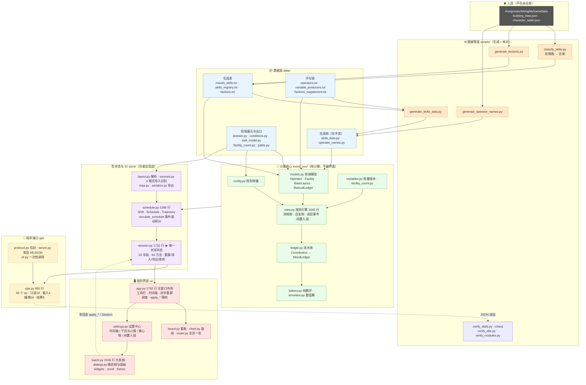
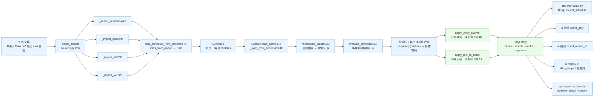
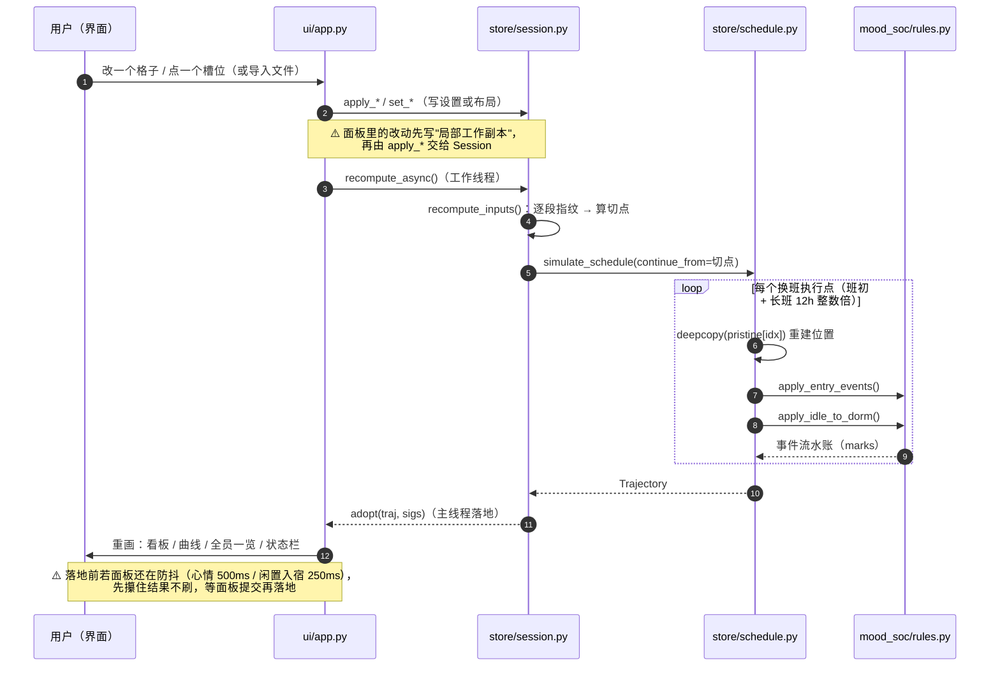
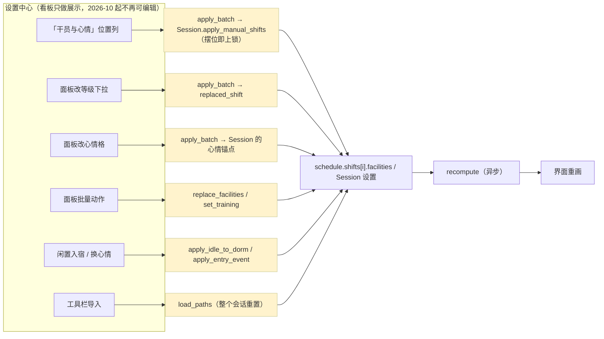

# 15-架构图

> **这份文件只画图，不重复讲规则**。规则看 `01-架构.md`（分层与公共 API）、
> `14-架构总览.md`（现状测绘 + 病灶 + 七模块归属）。
>
> 四张图，四个视角：
> **图 1 分层大图**（数据 → 处理 → 功能 → API → UI，一眼看清"谁在哪一层"）·
> **图 2 端到端数据流**（从上游仓库到屏幕上的曲线，带真实函数名与文件）·
> **图 3 一次测算的时序**（重算一次，各层按什么顺序被调用）·
> **图 4 界面写路径**（界面上的每个动作最终写到哪份数据的哪个入口）。
>
> Mermaid 代码块在 GitHub / 支持 Mermaid 的编辑器里会渲染成图；纯文本阅读请用图 1 后面的 **ASCII 速览**
> （图 2~4 本身就是"节点 + 箭头"的短链，原文可读）。

---

> **目录**：图 1 分层大图（数据 → 处理 → 功能 → API → UI，附 ASCII 速览）·
> 图 2 端到端数据流 · 图 3 一次重算的时序 · 图 4 界面的编辑怎么落到数据（写路径）

---

## 图 1：分层大图（数据 → 处理 → 功能 → API → UI）



**ASCII 速览**

```
🌐 上游  Kengxxiao/ArknightsGameData（building_data.json / character_table.json）
   │
   ▼  scripts/ 数据管道（生成 + 核对）
⚙️ classify_skills.py → moods_skills.txt / skills_registry.txt
   generate_skills_data.py → skills_data.py（勿手改）
   generate_factions.py / generate_operator_names.py
   核对：verify_skills.py --check · verify_idle.py · verify_modules.py
   │
   ▼  data/ 数据层
📦 生成物 skills_data.py / operator_names.py ｜ 生成表 *_skills.txt / factions.txt
   手写表 operators.txt / variable_producers.txt / factions_supplement.txt
   基元 domain.py（设施容量·上限）· conditions.py（条件函数）
        skill_model.py · facility_count.py · paths.py（路径唯一出口）
   │
   ▼  mood_soc/ 计算核心（纯计算）
🧠 config.py 规则常量 ──┐
   models.py 领域模型 ──┼─► rules.py 规则引擎（消耗 / 回复 / 进驻事件 / 闲置入宿）
   variables.py 变量 ───┘        └─► ledger.py 流水账 → battery.py 积分
   simulator.py 数值解（--trace）
   │
   ▼  store/ 状态与 IO（功能实现层）
🗄️ layout.py / sources.py（4 格式识别）/ maa.py / serialize.py
   schedule.py  Shift · Schedule · Trajectory · simulate_schedule
   session.py 1732 行 ★ 唯一共享状态（排班+全部设置+重算+导入+导出+查询）
   │
   ├──────────────► api/ 程序接口（给 Rust / 外部调用）
   │                🔌 protocol/server/cli ＋ ops.py 38 个 op
   │
   ▼  ui/ 图形界面
🖥️ app.py 主窗口（工具栏 / 时间条 / 异步重算 / apply_* 落地）
   ├─ board.py 看板    ├─ chart.py 曲线    ├─ roster.py 全员一览
   └─ settings.py 设置中心 ─► 时间轴 / 干员与心情 / 换心情 / 闲置入宿（batch.py · dialogs.py）
        （界面上的编辑：先写局部副本 → apply_* → Session → 异步重算 → 重画）
```

---

## 图 2：端到端数据流（上游 → 屏幕）



**读法**：从左到右是**一条直线**——文件 → 识别 → 装配成 `Schedule` → 进 `Session` →
算增量切点 → 积分成 `Trajectory` → 分发给界面与接口。
唯一的"两个分叉"是段循环里的两个**布局事件**（进驻事件、闲置入宿），它们只在
`pristine` 的**深拷贝副本**上生效，永不写回你导入的排班。

---

## 图 3：一次重算的时序（谁调谁）



---

## 图 4：界面上的编辑怎么落到数据（写路径）



⚠️ 2026-10 之前的「看板点槽位 → `session.set_slots`」「看板点房间卡 → `set_room_level`」
两条**界面**入口已删（`ui/app.py::on_slot_left` 保留为**程序化入口**，界面不再绑定）；
`session.set_slots` / `set_facility_slots` / `set_seat_lock` / `clear_seat_locks` 仍可从
API / 测试调用。⚠️ **2026-10 第二批起 `set_seat_lock` / `clear_seat_locks` 只从 API 走**
（界面的逐位 `☑ 锁` 与「全部解锁…」按钮已删，见 `10-图形界面.md` §6.3 ——
手动编辑的界面口径是**摆位即上锁、清空即解锁**）。这张图上曾经"同一件事有两个入口"的地方（等级、选人、心情起点），
按 `14-架构总览.md` §7.2 / §7.3 / §4.5 的模块归属收敛后的现状见那里的最新口径。
